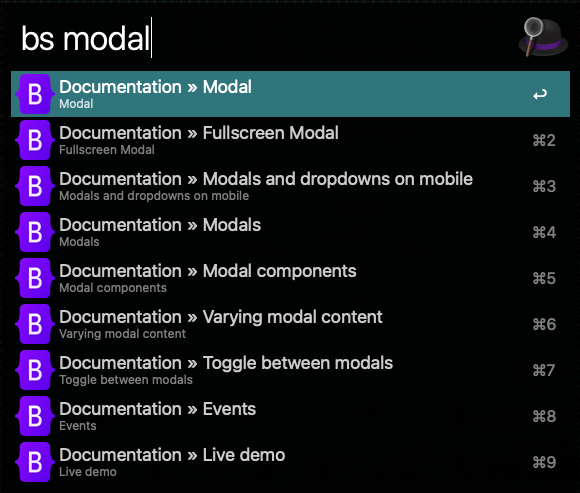

# Bootstrap 5 Docs Workflow for Alfred

[Bootstrap docs](https://getbootstrap.com/docs) search workflow for [Alfred 3+](https://www.alfredapp.com).



## Installation

1. [Download the latest version](https://github.com/jerryklimcik/alfred-bootstrap-docs/releases/download/0.1.2/alfred-bootstrap-docs.alfredworkflow)
2. Install the workflow by double-clicking the `.alfredworkflow` file
3. You can add the workflow to a category, then click "Import" to finish importing. You'll now see the workflow listed in the left sidebar of your Workflows preferences pane.

## Usage

Just type `bs` followed by your search query.

```
bs <query>
```

Either press `⌘Y` to Quick Look the result, or press `<enter>` to open it in your web browser.

## Changing versions

By default this workflow searches the `5.2` version of the docs. However, you can change that to any 5.x version listed on [getbootstrap.com/docs/versions](https://getbootstrap.com/docs/versions/).

1. Go to the _Bootstrap Docs_ workflow in your Alfred preferences
2. Click the `[𝝌]` icon
3. Set the value of `version` variable to your desired version (e.g. `5.1`)

### Note

Heavily inspired by [Alfred-laravel-docs by Till Krüss](https://github.com/tillkruss/alfred-laravel-docs) and big kudos to him.
The lightning fast search is powered by [Algolia](https://www.algolia.com) using the _same_ index as the official [Bootstrap CSS](https://getbootstrap.com) website.
